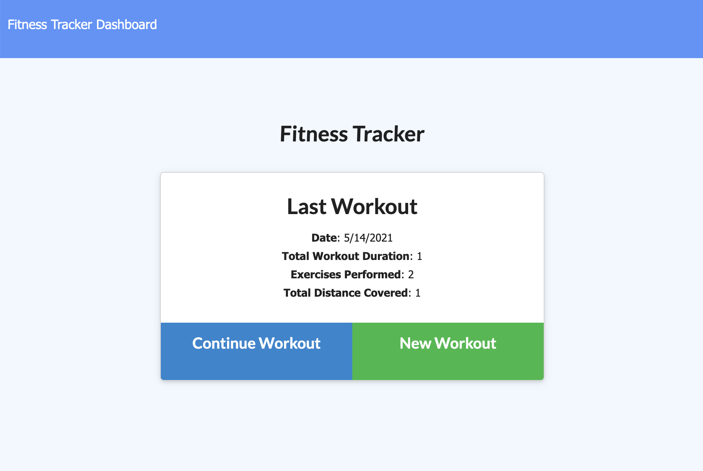

# Workout-Tracker
An app to view, create, and track daily workouts. The tracker allows the user to create a workout where they enter various exercises associated to the workout. Workout data can then be analyzed wto provide details of completed workouts.

## Uses

JS/Node/Express/MongoDb/Mongoose

-----------

## Installation Instructions

```
npm install
```

-----------

## Usagage Information

```
node server.js
```

-----------

## Live Demo

https://ericks-workout-tracker.herokuapp.com/

-----------

## Screen shot


-----------


## Questions
Reach out with additional questions:

[https://github.com/erickmeline](https://github.com/erickmeline) - [erickmeline@gmail.com](mailto://erickmeline@gmail.com)

